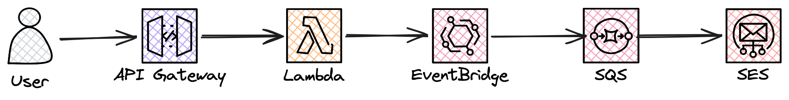

# email-next-sst

SST + Next.js email service using API Gateway, Lambda, EventBridge, SQS, and SES.



## Setup

### 1. Install AWS CLI

```bash
sudo apt update
sudo apt install awscli -y
```

### 2. Configure AWS credentials

```bash
aws configure --profile my-sst-user
```

Add the access keys for the IAM user you created with the required permissions.

### 3. Create a .env file

Create a `.env` file in the project root and add your AWS profile created with step 2:

```bash
AWS_PROFILE=my-sst-user
```

### 4. Verify SES identity

Go to **AWS Console → SES → Identities → Create Identity** and verify your email address. In sandbox mode both sender and recipient must be verified. For production you need a verified domain.

---

## Quick Start

Install dependencies:

```bash
npm install
cd web && npm install
```

Deploy:

```bash
npx sst deploy
```

---

## Local Development

```bash
npm run dev
```

---

## Tests

```bash
npm test
```

---

## Viewing Logs

Open the SST console to view live logs, SQS messages, EventBridge events, and API requests in one place:

```bash
npx sst console
```

For production logs:

```bash
npx sst console --stage production
```

---

## CI/CD

Push to `main` to trigger the GitHub Actions workflow. Tests run first and the deploy is blocked if any test fails. Make sure to add `AWS_ACCESS_KEY_ID` and `AWS_SECRET_ACCESS_KEY` to your repository secrets.

---

## Cleanup

Remove all AWS resources:

```bash
npx sst remove
```

---

## Notes

- Email sending requires SES sandbox mode to have both sender and recipient verified
- For production, verify a domain in SES and request production access to send to any address
- Never commit your `.env` file — it is listed in `.gitignore`
